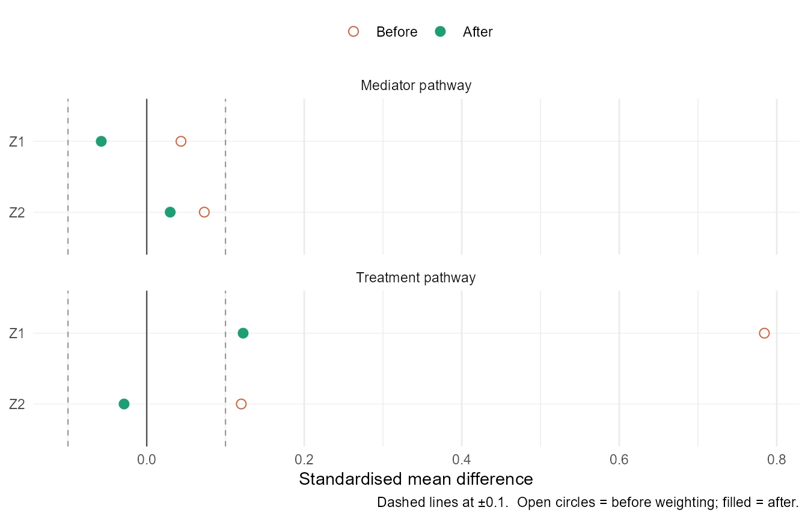
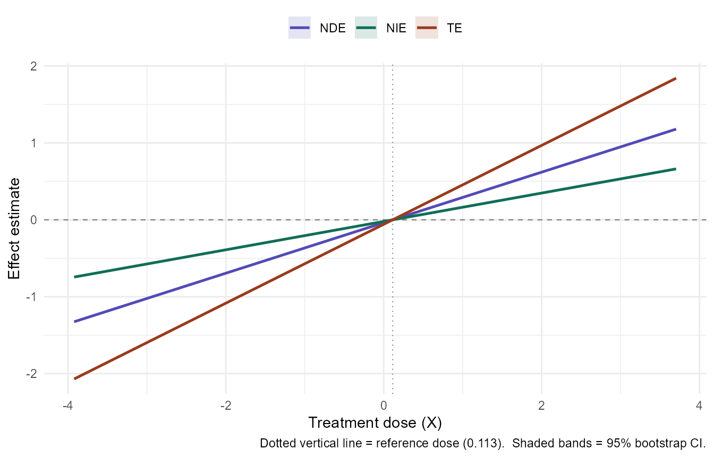
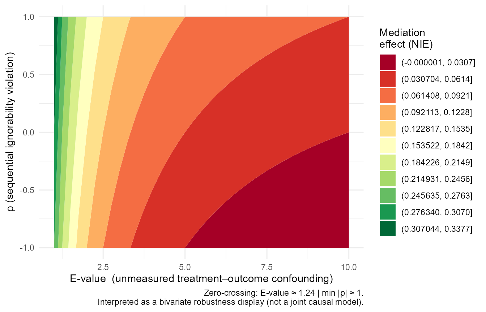

# Getting Started with RobustMediate

## Overview

**RobustMediate** estimates natural direct and indirect effects
(NDE/NIE) for continuous treatments using inverse probability weighting
(IPW). It embeds three publication-ready visualisations and a
paper-writing helper
([`diagnose()`](https://causalfragility-lab.github.io/RobustMediate/reference/diagnose.md))
directly into the package workflow.

## Simulated data

``` r

set.seed(42)
n  <- 600
Z1 <- rnorm(n)
Z2 <- rbinom(n, 1, 0.5)
X  <- 0.5 * Z1 + 0.3 * Z2 + rnorm(n)  # continuous treatment
M  <- 0.4 * X  + 0.2 * Z1 + rnorm(n)  # mediator
Y  <- 0.3 * X  + 0.5 * M  + 0.1 * Z1 + rnorm(n)  # outcome
dat <- data.frame(Y, X, M, Z1, Z2)
```

## Fitting the model

``` r

library(RobustMediate)

fit <- robustmediate(
  treatment_formula = X ~ Z1 + Z2,
  mediator_formula  = M ~ X + Z1 + Z2,
  outcome_formula   = Y ~ X + M + Z1 + Z2,
  data    = dat,
  R       = 200,   # use >= 500 in practice
  verbose = FALSE
)
print(fit)
#> -- RobustMediate fit ------------------------------------------
#>   Treatment: X  |  Mediator: M  |  Outcome: Y
#>   N = 600  |  Ref dose = 0.113  |  Bootstrap reps = 200
#> 
#>   Effects at focal dose (1.778 vs ref 0.113):
#>     NDE   0.5469  [NA, NA]
#>     NIE   0.3070  [NA, NA]
#>     TE    0.8539  [NA, NA]
#>     % mediated: 36.0%
#> 
#>   Balance (max |SMD| after weighting):
#>     Treatment pathway: 0.122  (1 covariate(s) above 0.10)
#>     Mediator pathway:  0.058  (0 covariate(s) above 0.10)
#> 
#>   medITCV available: yes
#>   medITCV profile available: yes
#> ---------------------------------------------------------------
```

## 1. Love Plot — `plot_balance()`

The love plot shows standardised mean differences (SMDs) before and
after IPW weighting for **both** the treatment and mediator pathways.
Reviewers require \|SMD\| \< 0.10; the dashed lines mark this threshold.

``` r

plot_balance(fit)
```



## 2. Dose-Response Curve — `plot_mediation()`

NDE and NIE as smooth curves over the full treatment range, with
pointwise bootstrap confidence bands. The dotted vertical line marks the
reference dose.

``` r

plot_mediation(fit, estimands = c("NDE", "NIE", "TE"))
#> Warning: Removed 300 rows containing missing values or values outside the scale range
#> (`geom_ribbon()`).
```



## 3. Sensitivity Contour — `plot_sensitivity()`

The novel bivariate robustness map. The x-axis is the E-value (how
strongly an unmeasured confounder would need to be associated with both
treatment and outcome to explain away the NIE). The y-axis is Imai’s ρ
(sequential ignorability violation). The bold dashed contour marks where
the NIE = 0.

``` r

plot_sensitivity(fit)
```



## 4. Diagnose — `diagnose()`

Prints a formatted report with a ready-to-paste Results paragraph.

``` r

diagnose(fit)
#> ==============================================================
#>            RobustMediate: Diagnostics Report
#> ==============================================================
#> 
#> -- Balance diagnostics ---------------------------------------
#>   Treatment pathway: max |SMD| = 0.122  (1 covariate(s) above 0.10)
#>   Mediator pathway:  max |SMD| = 0.058  (0 covariate(s) above 0.10)
#>   WARNING: Balance exceeds 0.10 on at least one covariate.
#>   Inspect plot_balance() carefully.
#> 
#> -- Mediation effects (focal dose = 1.778 vs ref = 0.113 ) ----------------
#>   NDE   +0.5469  [NA, NA]  (95% CI)
#>   NIE   +0.3070  [NA, NA]  (95% CI)
#>   TE    +0.8539  [NA, NA]  (95% CI)
#>   % mediated: 36.0%
#> 
#> -- Sensitivity 1: E-value x rho surface ----------------------
#>   E-value to nullify NIE:       1.24
#>   Minimum |rho| to nullify NIE: 1.00
#> 
#>   Suggested text for Results section:
#>   "Sensitivity analyses indicated that an unmeasured confounder
#>    would need to be associated 1.2 times with both treatment and outcome
#>    to fully explain away the estimated indirect effect
#>    (NIE = 0.307, 95% CI [NA, NA]).
#>    The sequential-ignorability violation |rho| would need to exceed
#>    1.00 to nullify this finding."
#> 
#> -- Sensitivity 2: medITCV ------------------------------------
#>   a-path (X -> M)
#>     Observed r = 0.3677  |  Critical r = 0.0802  |  medITCV = 0.2875  [robust]
#>     Need |r_XC * r_YC| > 0.2875 (31.3% above threshold)
#>   b-path (M -> Y | X)
#>     Observed r = 0.4208  |  Critical r = 0.0803  |  medITCV = 0.3406  [robust]
#>     Need |r_XC * r_YC| > 0.3406 (37.0% above threshold)
#> 
#>   Bottleneck: a-path (X -> M) (minimum-path medITCV = 0.2875)
#>   Use plot(fit, type = "meditcv") for visualization.
#> 
#> -- Sensitivity 3: medITCV robustness profile -----------------
#>   medITCV_a (X->M):        0.2875
#>   medITCV_b (M->Y|X):      0.3406
#>   medITCV_indirect:        0.2875
#>   Fragility ratio (a/b):   0.844
#>   Bottleneck:              a-path (X → M)
#> 
#>   Tipping-point confounder r = 0.536 would nullify the indirect effect.
#>   Use plot(fit, type = "meditcv_profile") for visualization.
#> 
#> --------------------------------------------------------------
```

## Clustered data

Supply `cluster_var` to account for clustering:

``` r

fit_clus <- robustmediate(
  treatment_formula = X ~ Z1 + Z2,
  mediator_formula  = M ~ X + Z1 + Z2,
  outcome_formula   = Y ~ X + M + Z1 + Z2,
  data        = dat,
  cluster_var = "school_id",
  R           = 500
)
```

## Theoretical note on the sensitivity contour

The E-value × ρ surface is a *bivariate robustness display*, not a joint
causal model. For each pair (E-value, ρ), the surface shows the
estimated NIE if **that single violation** were present. The dimensions
should be interpreted separately: researchers can ask how large each
violation would need to be—on its own—to overturn the finding.
